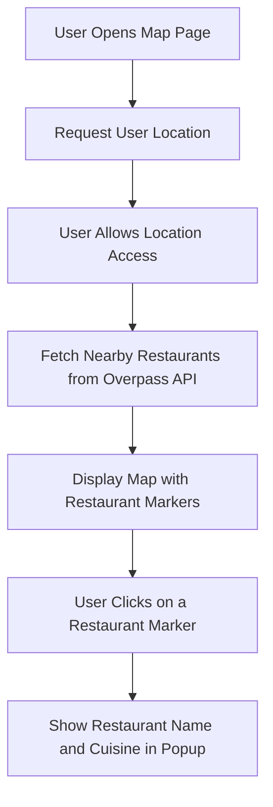

# Geolocation Map Diagram

## Description

The Geolocation Map feature allows users to view nearby restaurants based on their location. The restaurants are displayed on a map, and users can interact with the markers to view additional details about each restaurant. If location permission is denied, the user will not see the map.

The workflow includes:

- Requesting the user's location.
- Fetching restaurant data using the Overpass API.
- Displaying the map with restaurant markers.
- Showing details of a restaurant when a marker is clicked.

## Sequence Diagram

