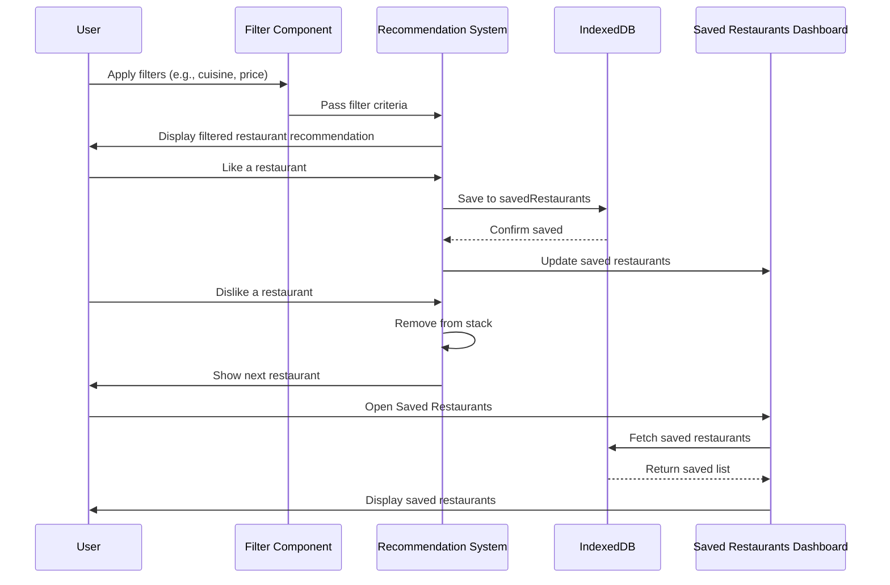

# Home Page and Restaurant Recommendation System

## Description

The Home Page and Restaurant Recommendation System is the feature on the home page where users are recommended restaurants to assess based on their preferences (which they can apply through a filter option). Once a recommendation is presented to the user, they have two options:

- Like the restaurant: Liking a restaurant will save the restaurant to the user's "saved restaurants" (implemented through persistent storage in indexeddb), where users can access them through the saved restaurants dashboard
- Dislike the restaurant: Disliking a restaurant will simply remove the restaurant from their view
After a user likes/dislikes the restaurant, the card stack will automatically display the next card and the user's saved restaurants will dynamically update, if applicable. 

The following work flow shows user interactions with the recommendation system and how the component integrates with the system as a whole, as well as other features.

## Sequence Diagram

