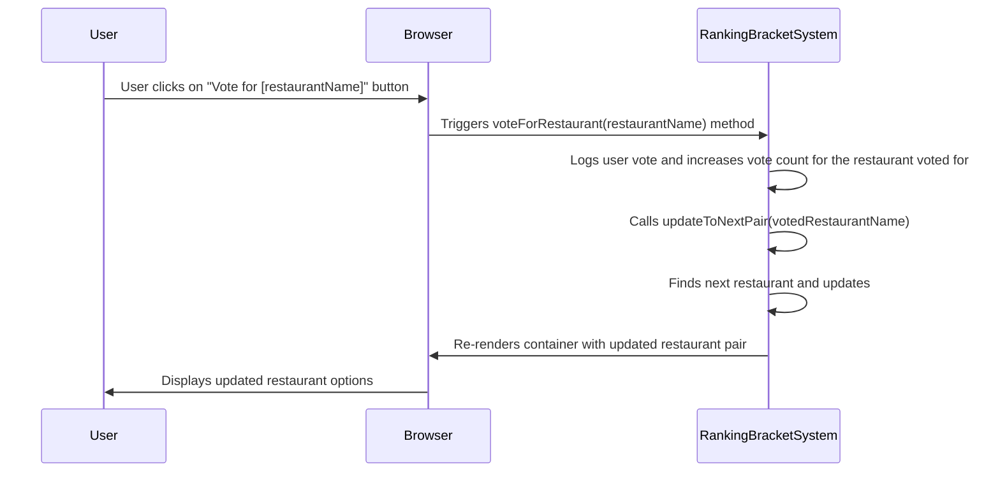

# Ranking Bracket System Diagram 

## Description

The goal of ranking bracket system is to narrow down tje restaurant options until the most ideal restaurant for the user is chosen. The feature accesses the date in localStorage to use as voting options. It is going to access the restaurants that the user voted yes on from the feature recommendation system. Each restaurant that is voted "yes" on will be used in this voting system. There are vote options for each restaurant option. On each restaurant card there's a button to vote, the name of the restaurant and the description of the restaurant with how expensive it is and the type of cuisine. When the user clicks the vote button for a restaurant, the system registers the vote, updates the current pair to show the next two restaurants, and notifies the user of their vote. The restaurant that is voted for will stay and the other restaurant option will switch. The last restaurant that is voted for will be the most perfect restaurant for the user. 

## Sequence Diagram

