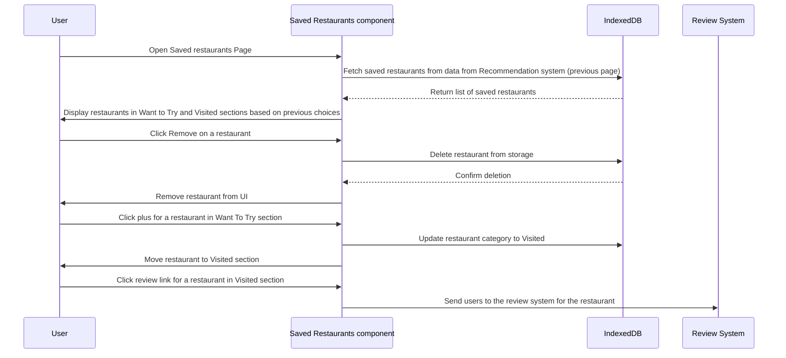

# Saved Restaurants Diagram

## Description

The Saved Restaurants feature is the feature where users can view and manage their saved restaurants. Restaurants are categorized into two categories:

- Want to Try: The restaurants the user has liked in the recommendation system but not marked as visited
- Visited: The restaurants the user has marked as visited

The work flow goes through the interactions between the user and the dashboard. This includes viewing saved restaurants, removing them, choosing to review a visited restaurant, and moving restaurants between categories.

## Sequence Diagram

