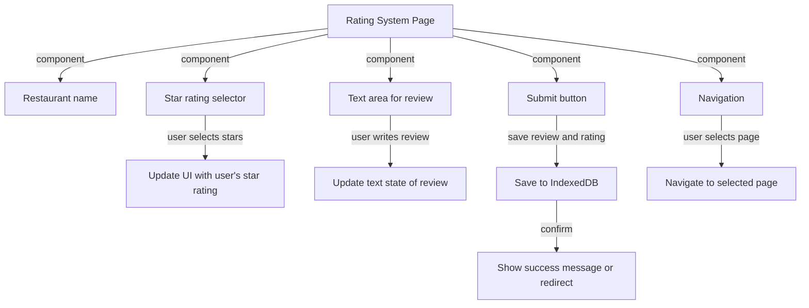

### Description:
The Ranking System allows the user to navigate from the saved dashboard page to rate the restaurant by selecting stars out of 5 and writing a review. After clicking the Submit button, the rating and review are saved to IndexedDB. Additionally, users can use the navigation bar to navigate to other parts of the web app. This sequence diagram illustrates the interactions within the Ranking System Component.

## Sequence Diagram
